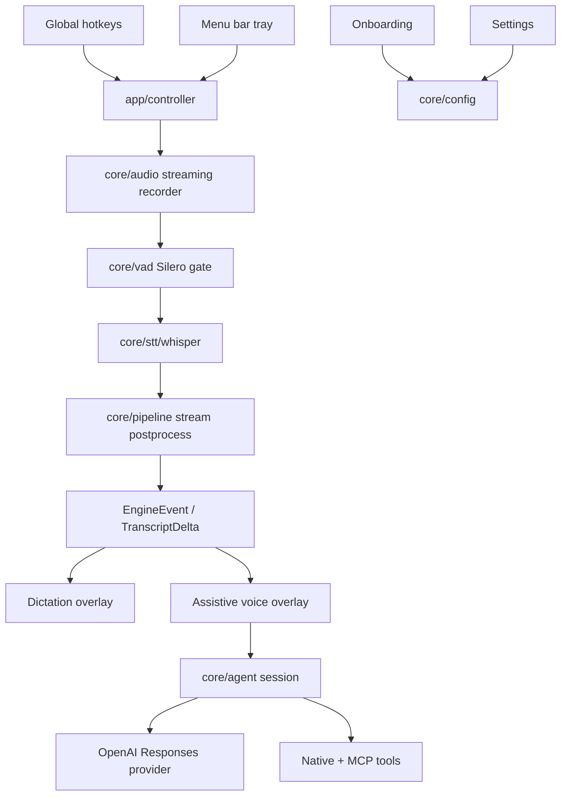

# CodeScribe Architecture

This is the canonical architecture map for the current repository. Historical proposals and older ADRs live under `docs/historical/` and must not be treated as current runtime truth unless this file points to them explicitly.

## Current Product Shape

CodeScribe is a native macOS menu-bar app for dictation and dictation-driven assistive work. The app has four user-facing runtime surfaces:

- Onboarding: first-run mode, language, permissions, API key, hotkey setup.
- Settings: persisted user settings, mode bindings, provider configuration.
- Dictation overlay: live transcript preview and final transcript actions.
- Assistive voice overlay: conversation timeline, attachments, tool activity, and agent replies.

The repo is split into a portable Rust core and a macOS app shell:

```text
core/                 portable pipeline, STT, config, state, LLM, agent contracts
app/                  macOS shell, controller, hotkeys, permissions, AppKit UI
bin/                  CLI entry points: codescribe, qube-report, qube-daemon
tests/                integration and E2E tests
docs/                 canonical docs plus quarantined historical material
```

## Runtime Flow



## Core Modules

| Area             | Current responsibility                                                    |
| ---------------- | ------------------------------------------------------------------------- |
| `core/audio/`    | Recording, chunking, streaming recorder plumbing.                         |
| `core/vad/`      | Silero VAD model lookup, speech segmentation, speech probability helpers. |
| `core/stt/`      | STT adapters, with Whisper as the live local preview path.                |
| `core/pipeline/` | Contracts, stream postprocess, deltas, event sinks, streaming session.    |
| `core/config/`   | Defaults, settings model, `.env`, Keychain, migration.                    |
| `core/llm/`      | Formatting path and Responses API streaming manager.                      |
| `core/agent/`    | Provider/session/event contracts for assistive mode.                      |
| `core/state/`    | History, notes, conversation state, runtime persistence.                  |
| `core/quality/`  | Qube quality report and daemon surfaces.                                  |

## App Modules

| Area                 | Current responsibility                                                      |
| -------------------- | --------------------------------------------------------------------------- |
| `app/controller/`    | Recording state machine, event routing, paste/assistive orchestration.      |
| `app/os/`            | macOS hotkeys, permissions, clipboard, selection, notifications.            |
| `app/ui/onboarding/` | First-run wizard. Basic is the safe default; Agentic adds readiness checks. |
| `app/ui/settings/`   | Settings window and persisted mode/provider controls.                       |
| `app/ui/overlay/`    | Dictation overlay and transcript actions.                                   |
| `app/ui/voice_chat/` | Assistive conversation UI, attachments, grouped tool activity.              |
| `app/agent/tools/`   | Native tool implementations and MCP status/readiness probes.                |

## Current Runtime Truth

- Local Whisper is the live preview path.
- Cloud STT remains configurable, but it is not the default live preview path.
- Formatting and assistive mode use OpenAI Responses API by default.
- Formatting default model: `gpt-4.1`.
- Assistive default model: `gpt-5.5`.
- Requests use `previous_response_id` chaining where supported.
- Onboarding has two lanes:
  - Basic: safe default, plain dictation/formatting.
  - Agentic: dictation-driven orchestration lane, gated by readiness checks.
- Agentic readiness currently requires Vibecrafted runtime, AICX MCP, Loctree MCP, and PRView integration.
- Assistive tool calls are grouped into one compact Tool Activity block per assistant turn. Raw tool payloads are debug/log evidence, not primary chat messages.

## Hotspots

Loctree currently reports these as high fan-in or notable risk surfaces:

| File                         | Why it matters                                              |
| ---------------------------- | ----------------------------------------------------------- |
| `core/pipeline/contracts.rs` | Central transcript/event contracts; changes ripple broadly. |
| `app/ui_helpers.rs`          | Compatibility shim with many importers.                     |
| `core/config/mod.rs`         | Public config re-export surface.                            |
| `core/vad/mod.rs`            | VAD public module surface.                                  |
| `app/os/permissions.rs`      | macOS permissions and onboarding/runtime prompts.           |
| `app/os/hotkeys/mod.rs`      | Public hotkey runtime interface.                            |

Before changing any of these, use `loct slice` and `loct impact`.

## What Is Historical

Docs under `docs/historical/` include useful design history, but they are not current architecture. In particular, older "Apple Speech primary", "tail_patcher", "final_bam", "speech-to-speech agent", and large layered-pipeline proposals are historical unless this file or current code reintroduces them.

## Verification

Closest repo gates:

```bash
make check
make test-quick
```

For runtime/product checks, launch the actual app path with `make install-app` or `make start` and verify onboarding, hotkeys, dictation overlay, settings, and assistive overlay behavior directly.
