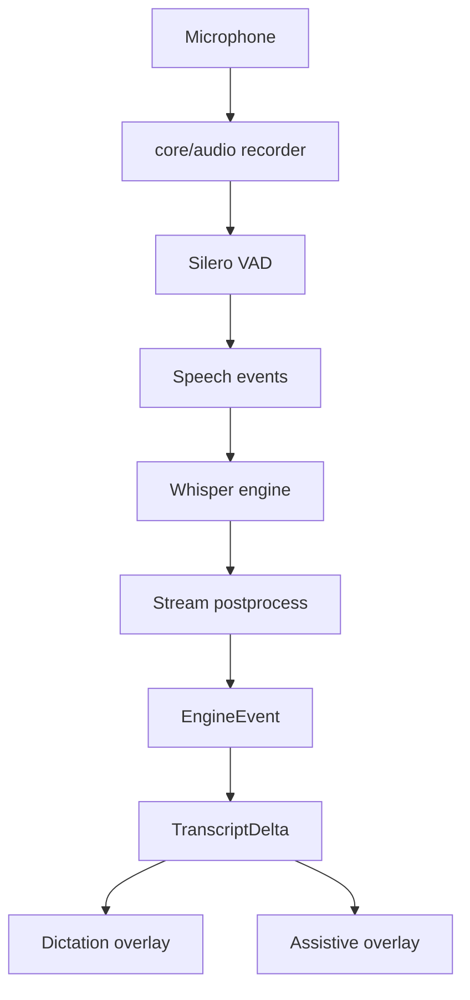

# Streaming Pipeline

This is the current live transcription pipeline. Historical layered-pipeline proposals were moved to `docs/historical/`.

## Current Flow



## Components

| Stage       | Files                                                        | Responsibility                                                         |
| ----------- | ------------------------------------------------------------ | ---------------------------------------------------------------------- |
| Capture     | `core/audio/recorder.rs`, `core/audio/streaming_recorder.rs` | Capture microphone samples and drive streaming.                        |
| VAD         | `core/vad/`, `core/audio/chunker.rs`                         | Segment speech and discard silence.                                    |
| STT         | `core/stt/whisper/`                                          | Local Whisper transcription with Metal acceleration.                   |
| Postprocess | `core/pipeline/stream_postprocess.rs`                        | Cleanup, semantic gate, anti-hallucination filtering.                  |
| Contracts   | `core/pipeline/contracts.rs`                                 | `EngineEvent`, `TranscriptDelta`, confidence and provenance.           |
| Routing     | `app/controller/`                                            | Route transcript events to overlay, paste, history, or assistive chat. |

## Preview Contract

Live preview is provisional. The UI must keep these concepts separate:

- active preview tail for the current utterance,
- committed utterances that are already safe to keep,
- final transcript verdict after capture finishes,
- formatted transcript when AI formatting is enabled,
- assistant interpretation in assistive mode.

Corrections may rewrite the active tail. They must not silently rewrite prior committed utterances.

## VAD Modes

| Mode              | VAD behavior                                                      |
| ----------------- | ----------------------------------------------------------------- |
| Hold dictation    | User controls start/stop; VAD segments speech within the capture. |
| Toggle formatting | Silence boundaries send accumulated utterances hands-free.        |
| Assistive         | Same capture substrate, routed to the voice/agent overlay.        |

## Current Non-Truth

The current code does not ship an Apple Speech primary live layer, `tail_patcher`, `final_bam`, or a five-layer overlay theatre. Those terms remain historical design material under `docs/historical/`.

## Verification

Useful test surfaces:

```bash
make test-quick
cargo test -p codescribe-core --lib pipeline
cargo test --test e2e_vad_auto_stop
```
