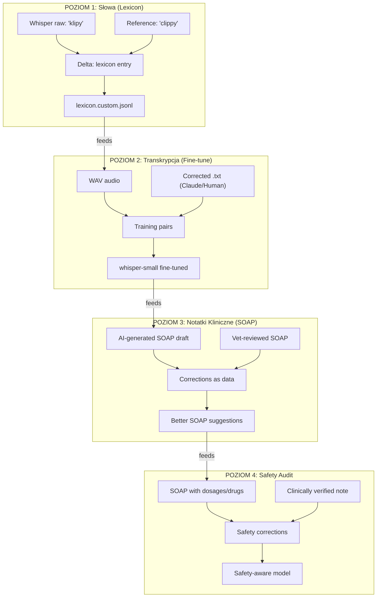
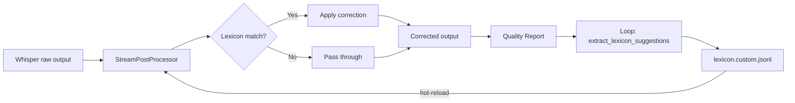
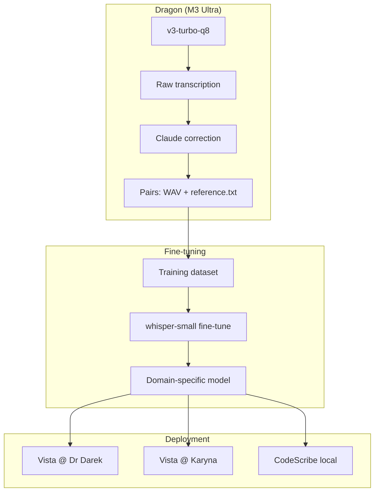
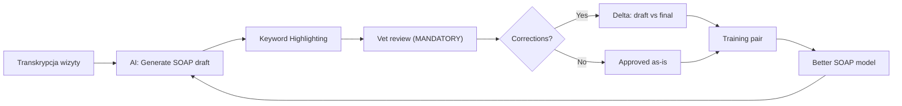
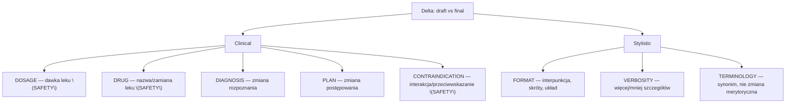
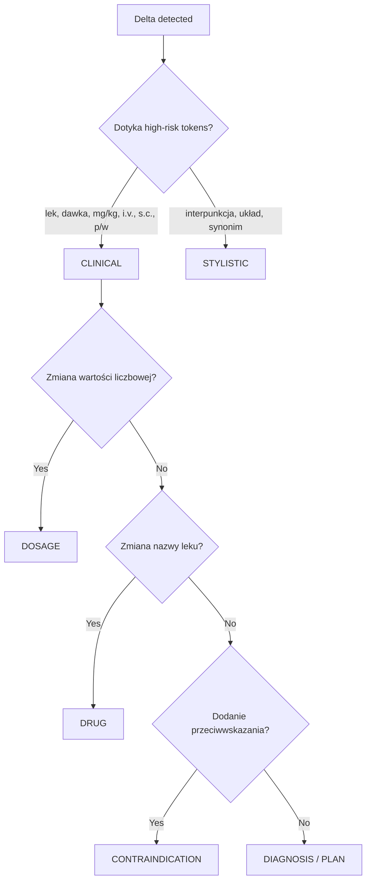

# Vista Kernel - Silnik bezpieczeństwa i intencji

## Quality Loop Architecture: From Typos to Clinical Safety

**Specyfikacja wielopoziomowej architektury self-improvement dla ekosystemu CodeScribe/Vista.**

*Created by Maciej & Monika (c)2026 VetCoders*

---

## Executive Summary

Quality loop to nie jest feature — to **architektura danych**, która skaluje się od korekty literówek do audytu bezpieczeństwa klinicznego.

Ten sam wzorzec (**raw → reference → delta → improvement**) powtarza się na 4 poziomach, a każdy poziom feeduje następny.

---

## 1. Architektura wielopoziomowa

---

## 2. Poziom 1: Korekta słów (DONE)

**Status:** Zaimplementowany w `codescribe-core/src/quality_[loop.rs](http://loop.rs)`

### Flow

### Dane wejściowe

- `~/.codescribe/transcriptions/<date>/*.wav` — audio
- `~/.codescribe/transcriptions/<date>/*.txt` — reference (ground truth)

### Dane wyjściowe

- `~/.codescribe/reports/quality_<ts>/report.json`
- `lexicon.custom.jsonl` — auto-generated corrections

### Reviewer: Claude (Klaudiusz)

- Zna domenę (weterynaria + programowanie)
- Zna akcent i wzorce mowy użytkownika
- Generuje reference `.txt` z raw Whisper output
- 95%+ accuracy bez ludzkiego odsłuchiwania
- Human wchodzi TYLKO na `[niewyraźne]` i `[niezrozumiałe]`

### Znane wzorce korekcyjne

| Whisper raw | Correct | Domena |
| --- | --- | --- |
| klipy | clippy | Rust tooling |
| Locktri, logstri, Log3, LogTee | loctree | Nasze narzędzie |
| Alfaxon | Alfaksalon | Anestezjologia wet. |
| Robbena coxip | Robenacoxib | NLPZ wet. |
| SEMGREB | semgrep | Security tooling |
| kargotarpaulym | cargo-tarpaulin | Rust coverage |
| PNPM-12 | pnpm dlx | JS package manager |
| exponential bugów | exponential backoff | CS concept |
| Pure Roost | Pure Rust | Programming language |
| stadio | stdio | Standard I/O |
| CodeScrap | CodeScribe | Nasz produkt |

---

## 3. Poziom 2: Fine-tune Whisper Small

**Status:** Planowany (po ~10 cyklach loopa)

### Cel

`v3-turbo-q8` (~888MB) jest za ciężki dla consumer Macs.

Whisper-small fine-tuned na domain-specific data osiąga porównywalną jakość **w naszej domenie** przy ~5× mniejszym modelu.

### Flow

### Wymagania do fine-tune

- **Dane:** ~50–100h domain-specific audio + perfect references
- **Źródło:** 10+ cykli quality loopa × ~30 nagrań/cykl = 300+ par
- **Hardware:** Dragon (M3 Ultra, 512GB) — trening lokalny
- **Output:** `whisper-small-pl-vetcoder` (custom model)

### Przewaga

- Whisper-small: ~244MB vs v3-turbo: ~888MB
- Runs on M1 base, maybe iPhone (CoreML export)
- Domain-trained: zna „Alfaksalon”, „loctree”, „clippy” z factory

---

## 4. Poziom 3: SOAP Notes Quality

**Status:** Koncepcyjny

### SOAP = Subjective, Objective, Assessment, Plan

Standardowy format notatki klinicznej w weterynarii.

### Flow: Zamknięcie wizyty = Quality Gate

### Mandatory Review = Automatic Training Data

**Kluczowy insight:** Zamknięcie wizyty w Vista WYMAGA przeglądu notatki. To nie jest opcjonalny krok — to jest obowiązkowa część workflow dokumentacji klinicznej.

To oznacza:

- **Każda zamknięta wizyta = verified training pair** (draft vs approved)
- **Keyword highlighting** (pomysł Moniki, kod istnieje!) podświetla leki, dawki, diagnozy — dokładnie to, co wymaga uwagi
- **Workflow IS the loop** — żaden osobny „quality step” nie jest potrzebny
- **Skala:** 5 weterynarzy × 20 wizyt × 30 dni = **3000 par/miesiąc** bez dodatkowej pracy

### Transparentność: Vet jako Partner

> **"Wiesz, że każda Twoja korekta poprawia system dla wszystkich?"**
>

Vet **POWINIEN wiedzieć**, że jego praca ulepszająca notatki ma wartość. To nie jest ukryte zbieranie danych — to partnerstwo:

- Vet widzi: „Twoje korekty poprawiły dokładność sugestii o 12% w tym miesiącu”
- Vet czuje: jestem współtwórcą lepszego narzędzia, nie betatesterem
- Vet zyskuje: z każdym miesiącem mniej korekt, bo system się uczy jego stylu
- **Motywacja:** Im dokładniej korektujesz, tym szybciej system przestaje wymagać korekt

To jest różnica między dark patternem a etycznym produktem.

### Analogia do Poziomu 1

| Quality Loop (L1) | SOAP Loop (L3) |
| --- | --- |
| WAV = raw input | Transcription = raw input |
| Whisper output = hypothesis | AI SOAP draft = hypothesis |
| Reference `.txt` = ground truth | Vet-approved SOAP = ground truth |
| WER = metric | Clinical accuracy = metric |

### Delta jako dane (z taksonomią)

Każda korekta veta w SOAP note to:

1. Co AI zaproponował (draft)
2. Co vet zmienił (final)
3. **Typ zmiany (delta type)** — kluczowe dla jakości uczenia
4. Kontekst (gatunek, wiek, masa, objawy)

→ Training data dla lepszych sugestii AI.

### Taksonomia Delt (Delta Types)

> **Bez tego model miesza sygnał.** Korekta „Alfaksalon” → „Alfaxan” (marka vs generyk)
to zupełnie inny sygnał niż „10mg/kg” → „3mg/kg” (safety critical).
>

| Delta Type | Waga w treningu | Przykład |
| --- | --- | --- |
| `DOSAGE` | **Krytyczna** | „10mg/kg” → „3mg/kg” |
| `DRUG` | **Krytyczna** | „Meloksykam” → „Robenacoxib” (kot z CKD) |
| `CONTRAINDICATION` | **Krytyczna** | dodanie „p/w u kotów z niewyd. nerek” |
| `DIAGNOSIS` | Wysoka | „zapalenie” → „ropne zapalenie” |
| `PLAN` | Wysoka | dodanie „kontrola za 3 dni” |
| `TERMINOLOGY` | Niska | „Alfaksalon” → „Alfaxan” (marka) |
| `FORMAT` | Ignorowana | przecinek, nowa linia |
| `VERBOSITY` | Niska | skrócenie opisu — styl veta |

### Reference Quality Tags

> **Reference ≠ zawsze prawda.** Zaakceptowana notatka bywa kompromisem lub stylem.
Bez tagów jakości nie wiemy czy uczymy się prawdy klinicznej czy nawyku.
>

Każda zaakceptowana notatka (reference) dostaje tag:

| Tag | Znaczenie | Wartość treningowa |
| --- | --- | --- |
| `CORRECTED_CLINICAL` | Vet zmienił lek/dawkę/diagnozę | **Najwyższa** — uczenie safety |
| `CORRECTED_STYLE` | Vet zmienił styl/format | Niska — personalizacja, nie klinika |
| `APPROVED_UNCHANGED` | Vet zaakceptował bez zmian | Pozytywny sygnał — draft był OK |
| `APPROVED_FAST` | Vet kliknął <3s (może nie czytał) | **Pomijana** — niski confidence |
| `OVERRIDDEN_SAFETY` | Vet zignorował safety warning | **Flagowana** — wymaga audytu |

### Klasyfikacja Delta Type (reguły)

> **Zasada domyślna:** Jeśli delta dotyka tokenów high-risk → CLINICAL.
Inaczej → STYLISTIC. Unikamy „szarej strefy”.
>

**High-risk tokens (seed list):**

- Jednostki: `mg`, `kg`, `ml`, `mg/kg`, `µg`, `j.m.`, `IU`
- Drogi podania: `i.v.`, `s.c.`, `i.m.`, `p.o.`, `per os`, `dożylnie`, `podskórnie`
- Leki: pattern match z bazy leków (vistakernel drug DB)
- Częstotliwość: `co 8h`, `BID`, `SID`, `TID`, `q12h`
- Kontraindykacje: `przeciwwskazane`, `p/w`, `nie stosować`, `uwaga`

### APPROVED_FAST — podwójna rola

`APPROVED_FAST` (<3s) to nie tylko „pomijana w treningu”:

1. **Metryka adopcji UX** — ile notatek vet „przelatuje” = czy UI jest zbyt inwazyjny?
2. **Safety trigger** — jeśli w tekście wykryto high-risk tokens (leki/dawki), a vet kliknął <3s:
    - Vista wyświetla: „Notatka zawiera leki/dawki. Na pewno?”
    - Jeśli vet potwierdzi po ponownym przejrzeniu → tag zmienia się na `APPROVED_UNCHANGED`
    - Jeśli poprawi → `CORRECTED_CLINICAL` (wartościowe!)

### OVERRIDDEN_SAFETY — wartość analityczna

> **Override nie jest błędem veta** — to zdarzenie o wysokiej wartości analitycznej.
>

Może oznaczać:

- **Luka w KB** — safety warning był fałszywy, bo baza nie zna wyjątku klinicznego
- **Wyjątek kliniczny** — vet wie coś, czego model nie (np. specyficzny pacjent, toleruje wyższe dawki)
- **Nowy protokół** — vet stosuje nowszy schemat niż baza

Każdy override generuje:

1. Log z kontekstem (co było flagowane, co vet zostawił, dlaczego — opcjonalna nota)
2. Ticket do review KB (czy dodać wyjątek? czy update bazy?)
3. Sygnał do safety modelu: „ten pattern nie jest jednoznacznie błędny”
